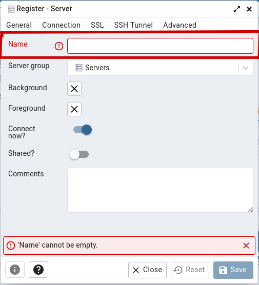
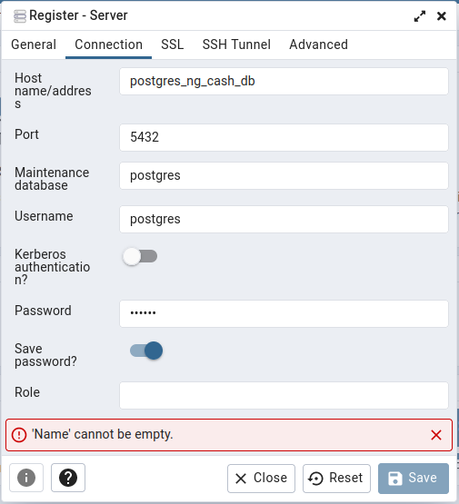

[](https://github.com/fmarconi777/tech_challenge_ng_cash/actions/workflows/app-ci.yml)
[](https://coveralls.io/github/fmarconi777/tech_challenge_ng_cash)

# [Backend processo seletivo NG.CASH <> TRYBE](https://ngcash.notion.site/Processo-Seletivo-NG-TRYBE-223de32e1ed047f2aa90cc0da84754ee/)

## Geral
Projeto desenvolvido em
* Typescript / Javascript

Framework de teste
* Jest

## Dependências

* Node: versão 16.x
* Docker
* Docker Compose

<br>
<br>

## Instalação

Na raíz do projeto execute

```
npm install
```

Crie na raíz do projeto o arquivo .env e insira as seguinte variáveis:
```
# Hasher salt
SALT = '12'

# Database connections

DB_DEV_NAME = 'dev_db'
DB_DEV_USER = 'postgres'
DB_DEV_PASSWORD = '123456'
DB_DEV_HOST = 'postgres'
DB_DEV_DIALECT = 'postgres'

DB_TEST_NAME = 'test_db'
DB_TEST_USER = 'postgres'
DB_TEST_PASSWORD = '123456'
DB_TEST_HOST = 'localhost'
DB_TEST_DIALECT = 'postgres'

# App port

APP_PORT = '5000'

# Jwt secret key

SECRET_KEY = 'secret_key'
```

Em seguida execute o comando
```
docker-compose up -d
```

### Criando o banco de dados

Para criar o banco de dados de desenvolvimento e teste execute os seguintes comandos
```
npm run create:dev
```
e
```
npm run create:test
```
Para criar as tabelas execute
```
npm run migrate:dev
```
e
```
npm run migrate:test
```
### Caso queira, os passos acima podem ser executados manualmente pelo pgAdmin
Conceda permissão de leitura e escrita as pastas 'database' e 'pgadmin-data' criadas na raíz.

Acesse `localhost:8080/`
<br>


<br>

Para autenticar use as credenciais 'admin@admin.com' para o login e '123456' para a senha

<br>

Solicitando a inclusão de um novo servidor

<br>


<br>

Será necessário informar os parâmetros para conexão, conforme indicado na imagem a seguir.

Na aba General informar a identificação (Name) da conexão):

<br>



<br>

Já na aba Connection preencher as seguintes configurações:

* Em Host name/address informar o nome do container que corresponde à instância do PostgreSQL, no caso será postgres_ng_cash_db;
* Em Port definir o valor 5432 (porta indicada para acesso ao container quando da sua criação);
* No atributo Username será informado o usuário default do PostgreSQL (postgres), bem como a senha correspondente em Password (123456).

<br>



<br>

E ao concluir esse processo estaremos finalmente acessando a instância do PostgreSQL.

<br>

Feito isto, opcionalmente, o seguinte comando pode ser executado para testar o projeto e a conexão.
Em caso de sucesso todos os testes deverão passar.
```
npm test
```

<br>

## Executando a aplicação
Para que a aplicação possa ser executada corretamente execute o comando abaixo para garantir que todos os serviços
do docker-compose estão parados
```
npm run down
```
Caso ainda não tenha feito, conceda permissão de leitura e escrita as pastas 'database' e 'pgadmin-data' criadas na raíz e em seguida execute
```
npm run up
```
A aplicação será executada no endereço `http://localhost:5000/api`, aceitando as seguintes chamadas:

* `http://localhost:5000/api/balance` - Método GET (necessita de autenticação)
* `http://localhost:5000/api/login` - Método POST (necessita de prévio cadastro)

<br>
O body da requisição deve conter os seguintes parâmetros

```
{
  "username": "username",
  "password": "password"
}
```

* `http://localhost:5000/api/signup` - Método POST (para cadastro)

<br>
O body da requisição deve conter os seguintes parâmetros. O parâmetro username deve ser alfa-numérico e não aceita caracteres especiais.

```
{
  "username": "username",
  "password": "password"
}
```
* `http://localhost:5000/api/transaction` - Método POST (necessita de autenticação)

<br>
O body da requisição deve conter os seguintes parâmetros

```
{
  "creditedUsername": "username",
  "value": "100.00"
}
```
* `http://localhost:5000/api/transaction` - Método GET (necessita de autenticação)
* `http://localhost:5000/api/transactiontransaction/cashIn` - Método GET (necessita de autenticação)
* `http://localhost:5000/api/transactiontransaction/cashOut` - Método GET (necessita de autenticação)
* `http://localhost:5000/api/transactiontransaction/date` - Método POST (necessita de autenticação)

<br>
O body da requisição deve conter os seguintes parâmetros, onde o formato de data deve ser exatamente como mostrado abaixo

```
{
  "startDate": "2022-11-28",
  "endDate": "2022-11-28"
}
```